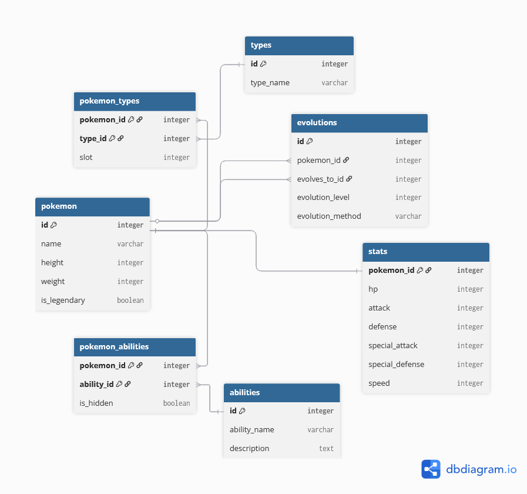

# Pokédex Database

<p align="center">
  
  
  
</p>

A normalized PostgreSQL database project demonstrating database design, SQL proficiency, and QA testing methodologies.

## Project Overview

Built as part of my transition into Quality Assurance, this project showcases my ability to design relational databases, write complex SQL queries, and apply QA thinking to identify data integrity issues.

## Purpose

- Learn database normalization principles
- Practice writing complex SQL queries with JOINs
- Apply QA methodologies (exploratory testing, boundary testing, data validation)
- Build a portfolio piece demonstrating technical SQL skills

## Technologies Used

- **Database:** PostgreSQL 16
- **Tools:** DBeaver
- **Language:** SQL

## Database Schema

Visual representation of the database structure and relationships:



The database consists of 7 interconnected tables:

### Core Tables
- **pokemon** - Basic Pokémon information (id, name, height, weight, legendary status)
- **types** - Master list of all Pokémon types (Fire, Water, Grass, etc.)
- **abilities** - Master list of abilities with descriptions
- **stats** - Individual stat values (HP, Attack, Defense, Sp.Attack, Sp.Defense, Speed)
- **evolutions** - Evolution chains and requirements

### Junction Tables (Many-to-Many Relationships)
- **pokemon_types** - Handles Pokémon with dual types (e.g., Charizard: Fire + Flying)
- **pokemon_abilities** - Connects Pokémon to their abilities, including hidden abilities

## ✨ Key Features

✅ **Proper Normalization** - Data is organized to minimize redundancy and maintain integrity

✅ **Referential Integrity** - Foreign key constraints prevent orphaned records and invalid data

✅ **Many-to-Many Relationships** - Junction tables properly handle complex relationships

✅ **Data Validation** - Constraints ensure data quality (UNIQUE, NOT NULL, CHECK)

✅ **Self-Referencing Tables** - Evolutions table references the pokemon table twice

##  QA Testing & Findings

Applied exploratory and boundary testing methodologies to identify data integrity issues:

### Bugs Found

**BUG-001: Missing Constraint on Type Slots**
- **Severity:** Medium
- **Issue:** System allowed Pokémon to have more than 2 types (slots > 2)
- **Expected:** Pokémon should only have 1-2 types maximum
- **Root Cause:** Missing CHECK constraint on `pokemon_types.slot` column
- **Fix:** Add `CHECK (slot IN (1, 2))` constraint

### Sample Validation Queries
```sql
-- Find records with too many types (should be max 2)
SELECT pokemon_id, COUNT(*) 
FROM pokemon_types 
GROUP BY pokemon_id 
HAVING COUNT(*) > 2;

-- Find records with missing names
SELECT * FROM pokemon WHERE name IS NULL;

-- Find records with invalid stats (negative values)
SELECT * FROM stats WHERE hp < 0 OR attack < 0;

-- Find duplicate entries
SELECT pokemon_id, type_id, COUNT(*) 
FROM pokemon_types 
GROUP BY pokemon_id, type_id 
HAVING COUNT(*) > 1;
```

## Complex Query Examples

### Show Pokémon with Their Types
```sql
SELECT 
    p.name AS pokemon_name,
    STRING_AGG(t.type_name, ', ' ORDER BY pt.slot) AS types
FROM pokemon p
JOIN pokemon_types pt ON p.id = pt.pokemon_id
JOIN types t ON pt.type_id = t.id
GROUP BY p.name
ORDER BY p.name;
```

**Example Output:**
| pokemon_name | types |
|--------------|-------|
| Bulbasaur | Grass, Poison |
| Charizard | Fire, Flying |
| Charmander | Fire |
| Pidgey | Normal, Flying |

---

### Display Evolution Chains
```sql
SELECT 
    p1.name AS evolves_from,
    p2.name AS evolves_to,
    e.evolution_level,
    e.evolution_method
FROM evolutions e
JOIN pokemon p1 ON e.pokemon_id = p1.id
JOIN pokemon p2 ON e.evolves_to_id = p2.id
ORDER BY p1.name;
```

**Example Output:**
| evolves_from | evolves_to | evolution_level | evolution_method |
|--------------|------------|-----------------|------------------|
| Bulbasaur | Ivysaur | 16 | level_up |
| Charmander | Charmeleon | 16 | level_up |
| Charmeleon | Charizard | 36 | level_up |
| Ivysaur | Venusaur | 32 | level_up |

---

### Find All Fire-Type Pokémon with Stats
```sql
SELECT 
    p.name AS pokemon_name,
    s.hp,
    s.attack,
    s.defense
FROM pokemon p
JOIN pokemon_types pt ON p.id = pt.pokemon_id
JOIN types t ON pt.type_id = t.id
JOIN stats s ON p.id = s.pokemon_id
WHERE t.type_name = 'Fire'
ORDER BY s.attack DESC;
```

**Example Output:**
| pokemon_name | hp | attack | defense |
|--------------|-----|--------|---------|
| Charizard | 78 | 84 | 78 |
| Charmeleon | 58 | 64 | 58 |
| Charmander | 39 | 52 | 43 |


## 🎓 Skills Demonstrated

- Database design and normalization (1NF, 2NF, 3NF)
- Writing complex SQL queries with multiple JOINs
- Understanding relationships (one-to-one, one-to-many, many-to-many)
- Data integrity constraints (PRIMARY KEY, FOREIGN KEY, UNIQUE, CHECK)
- QA methodologies (exploratory testing, boundary testing, data validation)
- Test case documentation and bug reporting
- Problem-solving and analytical thinking

## 📦 Getting Started

### Prerequisites
- PostgreSQL 16 or higher
- PostgreSQL client (DBeaver, pgAdmin, or psql)

### Installation

1. Clone this repository
```bash
git clone https://github.com/MiguelEloii/pokedex-database.git
```

2. Create a new database
```sql
CREATE DATABASE pokedex;
```

3. Import the backup file
   - **Using DBeaver:**
     - Right-click on the `pokedex` database → SQL Editor → Open SQL Script
     - Select `pokedex_backup.sql`
     - Click Execute (▶️) or press Ctrl+Enter
   - **Using psql (command line):**
     ```bash
     psql -U postgres -d pokedex -f pokedex_backup.sql
     ```
   - **Using pgAdmin:**
     - Right-click on the `pokedex` database → Query Tool
     - Open the `pokedex_backup.sql` file
     - Execute the script
     
## 👤 About Me

I'm Miguel, transitioning into Quality Assurance with a focus on backend testing, API testing, and test automation. This project demonstrates my SQL skills and QA mindset as I build hands-on experience in software quality assurance.

**Connect with me:**
- GitHub: [@MiguelEloii](https://github.com/MiguelEloii)

## 📄 License

This project is open source and available for educational purposes.

---

⭐ **If you found this project helpful or interesting, please consider giving it a star!**
